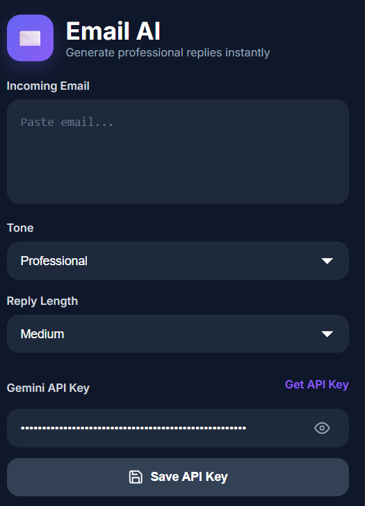
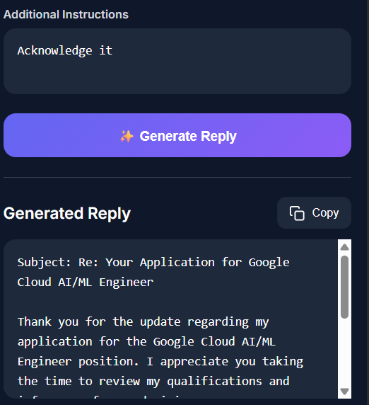
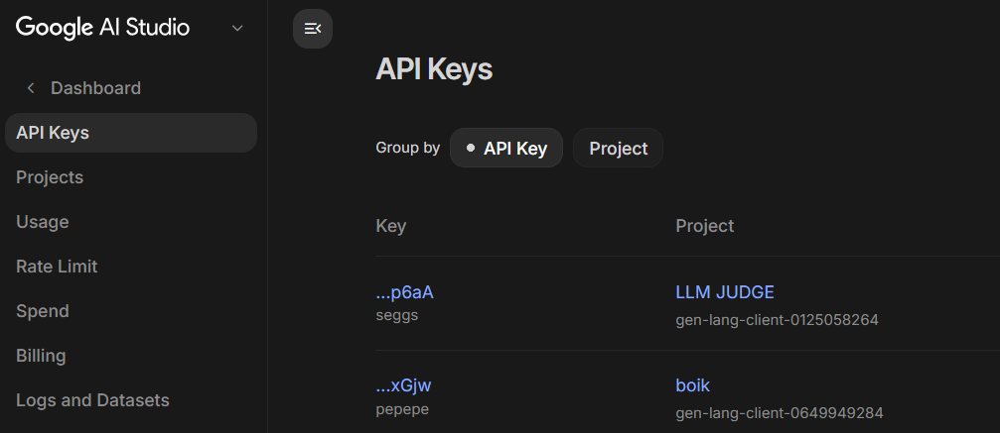
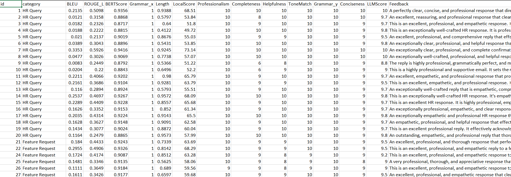

# 📧 AI Email Suggested Response System

<div align="center">


Generate professional AI-powered email replies directly from a Chrome Extension using **Google Gemini 2.5 Flash**, **FastAPI**, and **Prompt Engineering**.

</div>

---

# 🚀 Project Overview

Writing professional email replies takes time, especially when handling customer support, HR communication, or business emails.

This project provides an AI-powered email assistant capable of generating natural, professional, and context-aware email replies based on:

- Email content
- Selected tone
- Additional user instructions
- Gemini AI

The project also includes a modern Chrome Extension so users can generate replies instantly without visiting another website.

---

# ✨ Features

- 🤖 AI-powered email reply generation using Google Gemini 2.5 Flash
- 🎯 Multiple reply tones
  - Professional
  - Friendly
  - Formal
  - Empathetic
  - Confident
- 📏 Reply Length Control
  - Short
  - Medium
  - Long
- 📝 Additional custom instructions
- 🔐 Bring Your Own Gemini API Key
- 👁 Show / Hide API Key
- 💾 Save API Key locally using Chrome Storage
- 📋 One-click Copy Reply
- ⏳ Loading indicator while AI generates the reply
- 🔔 Toast notifications for user actions
- ⚡ FastAPI backend
- 🌐 Public deployment on Render
- 🔄 Automatic retry mechanism
- 🛡 Robust error handling
  - Invalid API Key
  - Quota Exhausted
  - Network Failure
  - Empty Response
  - Internal Server Errors

---

# 🛠 Tech Stack

## Backend

- Python
- FastAPI
- Google Gemini 2.5 Flash API
- Pydantic
- Uvicorn

## Frontend

- HTML
- CSS
- JavaScript

## Chrome Extension

- Manifest V3
- Chrome Storage API
- Fetch API

## Dataset & Evaluation

- JSON Dataset
- BLEU Score
- ROUGE-L Score
- LLM Judge Evaluation
- Local Quality Evaluation

---

# 📂 Project Structure

```text
AI-Email-Suggested-Response-System/

│
├── api/
│   └── app.py
│
├── dataset/
│   ├── emails.json
│   └── emails.csv
│
├── Reply_generator/
│   ├── generated/
│   └── reply_generater.py
│
├── evaluation and score/
│   ├── evaluate_old.py
│   ├── evaluate_local.py
│   ├── llm_judge.py
│   └── merge_scores.py
│
├── results/
│   ├── final_scores.csv
│   ├── llm_scores.csv
│   └── local_scores.csv
│
├── extension/
│   ├── popup.html
│   ├── popup.js
│   ├── style.css
│   └── manifest.json
│
├── requirements.txt
└── README.md
```

---

# 📊 Dataset Creation

A custom dataset was created consisting of realistic business emails.

Each sample contains:

- Email ID
- Subject
- Incoming Email
- Ideal Reply
- Category
- Tone
- Intent
- Urgency
- Difficulty

Example:

```json
{
"id":1,
"category":"Customer Support",
"tone":"Professional",
"intent":"Refund",
"incoming_email":"...",
"ideal_reply":"..."
}
```

---

# 🤖 Reply Generation Pipeline

The reply generator:

1. Loads dataset
2. Reads email information
3. Builds a dynamic prompt
4. Sends prompt to Gemini 2.5 Flash
5. Receives generated reply
6. Saves reply into JSON
7. Supports resume if generation stops

---
# 🔄 Application Workflow

1. User pastes an email into the Chrome Extension.
2. Selects a reply tone.
3. Selects the desired reply length.
4. (Optional) Adds additional instructions.
5. Clicks **Generate Reply**.
6. The extension sends a request to the FastAPI backend.
7. FastAPI forwards the prompt to Google Gemini 2.5 Flash.
8. Gemini generates a context-aware response.
9. The backend returns the generated reply.
10. The extension displays the reply and allows one-click copying.

---

# 🧠 Prompt Engineering


The prompt dynamically adapts based on user selections.

Inputs include:

- Incoming Email
- Selected Tone
- Reply Length (Short / Medium / Long)
- Additional Instructions

The prompt is designed to:

- Produce natural, human-like responses
- Match the selected tone
- Respect the requested reply length
- Answer every question in the email
- Avoid hallucinating information
- Request clarification when necessary
- Return only the email reply

---

# 📈 Evaluation

The generated replies were evaluated using multiple approaches.

### Traditional Metrics

- BLEU
- ROUGE-L

### Local Evaluation

- Grammar
- Readability
- Length

### LLM-as-a-Judge

Gemini evaluates generated replies on:

- Relevance
- Professionalism
- Helpfulness
- Tone
- Overall Quality

The individual scores are merged into a final evaluation report.

---

# 🌐 API

FastAPI exposes a REST API.

### POST

```
/generate
```

Example Request

```json
{
  "email": "...",
  "tone": "Professional",
  "length": "medium",
  "additional_instruction": "Keep it concise.",
  "api_key": "YOUR_GEMINI_API_KEY"
}
```

Example Response

```json
{
"success":true,
"reply":"..."
}
```

---

# 🧩 Chrome Extension

The Chrome Extension provides an intuitive interface for generating AI-powered email replies.

Features include:

- Paste incoming email
- Select reply tone
- Select reply length
- Add custom instructions
- Save Gemini API Key locally
- Show / Hide API Key
- Generate AI reply
- Copy generated reply
- Loading animation while generating
- Success toast notifications

---

# 🔑 Bring Your Own API Key

Users can use their own Gemini API Key.

The key is:

- Stored locally
- Never uploaded anywhere except Google's Gemini API
- Can be replaced anytime

Get your free Gemini API Key:

https://aistudio.google.com/apikey

---

# 🖥 Screenshots

## Extension Home




---

## Generated Reply




---

## API Key




---

## Evaluation Results




---

# ⚙ Installation

## 1 Clone Repository

```bash
git clone https://github.com/yourusername/AI-Email-Suggested-Response-System.git

cd AI-Email-Suggested-Response-System
```

---

## 2 Install Requirements

```bash
pip install -r requirements.txt
```

---

## 3 Start Backend

```bash
uvicorn api.app:app --reload
```

Backend runs at

```
http://127.0.0.1:8000
```

---

# 🧩 Load Chrome Extension

1. Download or clone this repository.

2. Open Chrome.

3. Navigate to:

```
chrome://extensions
```

4. Enable **Developer Mode**.

5. Click **Load Unpacked**.

6. Select the **extension** folder from this project.

7. Pin the extension.

8. Open the extension and enter your Gemini API Key.

9. Paste an email and generate professional AI replies instantly.

---

# 🚀 Deployment

The backend is currently deployed on **Render** using **FastAPI**, making it accessible over the internet for the Chrome Extension.

### Current Deployment

- ✅ Backend Hosting: **Render**
- ✅ Framework: **FastAPI**
- ✅ Public REST API Endpoint
- ✅ CORS Enabled for Chrome Extension Requests

### Keeping the Backend Alive

Render's free tier may put inactive services to sleep after a period of inactivity.

To minimize cold starts and keep the API responsive, a **Cron Job (Uptime Monitor)** periodically sends requests to the backend's health endpoint.

This ensures:

- 🚀 Faster response times
- ⏰ Reduced cold starts
- 🌐 Improved availability for extension users

### Health Check Endpoint

```
GET /
```

Example Response

```json
{
    "status": "running",
    "project": "Gen-AI Email Suggested Response System"
}
```

### Other Supported Deployment Platforms

Although this project is currently deployed on **Render**, it can also be deployed on:

- Railway
- Azure
- AWS
- Google Cloud Platform (GCP)

The Chrome Extension simply communicates with the deployed FastAPI endpoint, allowing users to generate AI-powered email replies from anywhere.
---

# 🔒 Error Handling

The application gracefully handles:

- Invalid Gemini API Key
- Gemini API Quota Exhaustion
- Network Connectivity Issues
- Backend Server Errors
- Empty User Input
- Empty AI Responses
- Temporary Gemini API Failures (Automatic Retry)

---

# ⚡ Performance Optimizations

- Cached Gemini model instance to reduce initialization overhead.
- Reuses API configuration when the same API key is provided.
- Automatic retry with exponential backoff for temporary failures.
- Optimized prompts to reduce unnecessary token usage.
- Reply length controlled through prompt engineering.
- Resume support during dataset generation.

---

# 📌 Future Improvements

- Gmail Integration
- Outlook Integration
- Reply History
- Multi-language Support
- One-click Email Sending
- Smart Email Classification
- Streaming Responses
- Reply Templates
- Dark/Light Themes
- User Authentication

---

# 👨‍💻 Developed By

**Hemang Joshi**

Computer Science Engineer

AI • Machine Learning • Software Engineer • Data Engineering

GitHub: https://github.com/Hemang648

LinkedIn: https://www.linkedin.com/in/hemangjoshi12/

---

# ⭐ If you like this project

Give this repository a ⭐ on GitHub.

It really helps!

---
